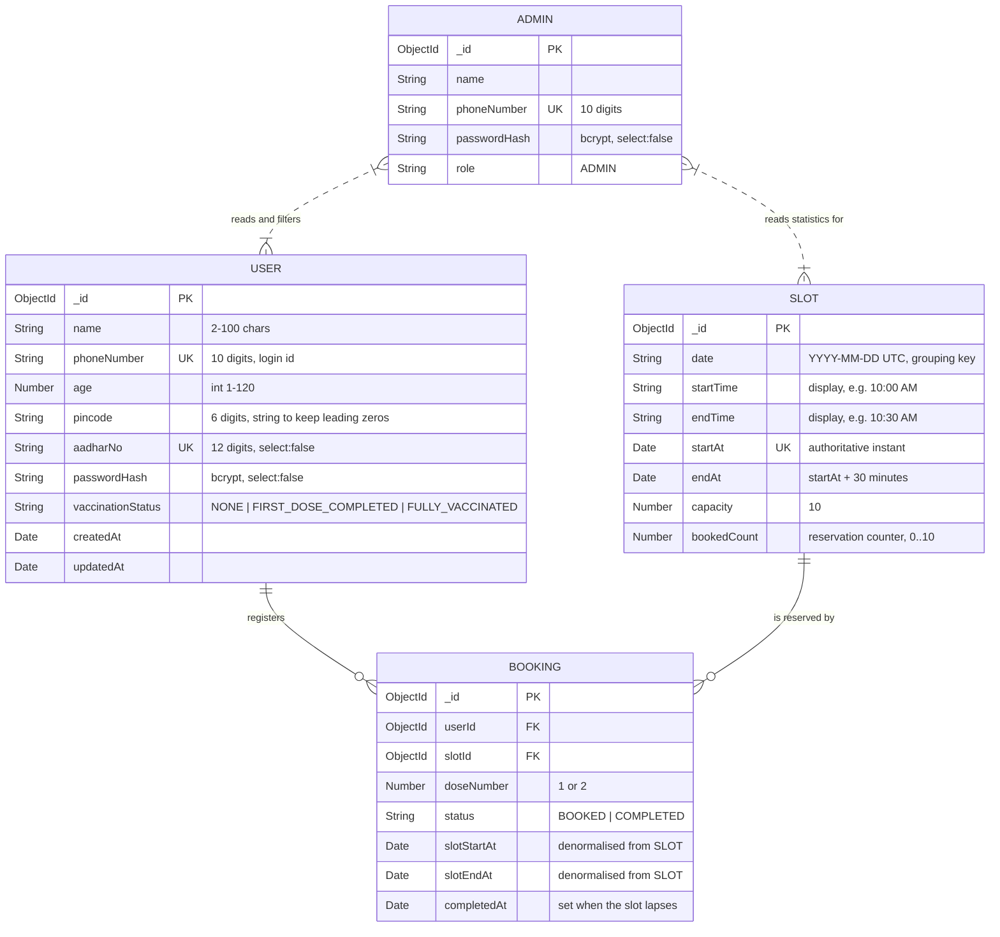

# Low-Level Design

This document describes the implementation as it actually is. Every field,
index and rule below exists in `src/`.

---

## 1. Entity-relationship diagram



Cardinality in practice: a user has **at most two** bookings (one per dose,
enforced by a unique index), and a slot has **at most ten**, enforced by the
atomic capacity guard rather than by an index.

---

## 2. Why the schema satisfies the assignment

| Assignment requirement | Schema element |
| --- | --- |
| Register with name, phone, age, pincode, Aadhaar | the six `USER` fields, all `required` |
| Phone number unique | `users.phoneNumber` unique index |
| Aadhaar unique | `users.aadharNo` unique index |
| Password never in plaintext | `passwordHash` only, `select: false`, bcrypt |
| Login by phone + password | `phoneNumber` is the login key and is indexed |
| Slots on a given day | `slots.date` + `{ date: 1, startAt: 1 }` index |
| 30-minute slots, 10 AM - 5 PM | `startAt`/`endAt` generated by a pure function |
| 10 doses per slot, shared by both doses | `slots.capacity` = 10 and one `bookedCount`, incremented by dose-1 and dose-2 bookings alike |
| Slot unavailable once full | `bookedCount < capacity` is the reservation predicate |
| Second dose only after the first | `users.vaccinationStatus` + the `resolveDose` state machine |
| "Vaccinated once the slot lapses" | `bookings.slotEndAt` + the lapse sweep; no manual confirmation |
| Change slot until 24h before | `bookings.slotStartAt` + `canModifyBooking` |
| Capacity released on change | old slot `$inc -1`, new slot conditional `$inc +1`, in one transaction |
| Admin: count and filter users | `age`, `pincode`, `vaccinationStatus` each indexed |
| Admin: per-day first/second/total | `bookings.slotStartAt` + `doseNumber` compound index |
| Admin seeded, no registration API | separate `admins` collection, no route mounted |

---

## 3. Indexes and the queries that justify them

| Collection | Index | Serves |
| --- | --- | --- |
| `users` | `{ phoneNumber: 1 }` unique | `findOne({phoneNumber})` on login; registration duplicate check |
| `users` | `{ aadharNo: 1 }` unique | registration duplicate check; the uniqueness rule itself |
| `users` | `{ vaccinationStatus: 1 }` | `GET /api/admin/users?vaccinationStatus=` |
| `users` | `{ pincode: 1 }` | `GET /api/admin/users?pincode=` |
| `users` | `{ age: 1 }` | `GET /api/admin/users?age=` and `?minAge=&maxAge=` |
| `admins` | `{ phoneNumber: 1 }` unique | admin login |
| `slots` | `{ startAt: 1 }` unique | seed upsert key; guarantees idempotency |
| `slots` | `{ date: 1, startAt: 1 }` | `find({date}).sort({startAt})` - available slots and admin statistics |
| `bookings` | `{ userId: 1, doseNumber: 1 }` unique | eligibility lookup; race-proof duplicate-dose guard |
| `bookings` | `{ status: 1, slotEndAt: 1 }` | the lapse sweep `find({status:BOOKED, slotEndAt:{$lte:now}})` |
| `bookings` | `{ slotStartAt: 1, doseNumber: 1 }` | daily statistics aggregation |
| `bookings` | `{ slotId: 1 }` | per-slot reconciliation and tests |

The three admin filters are independent and combine freely, so single-field
indexes are used and MongoDB intersects them. A single compound index would only
cover its prefixes and would leave `age`-only or status-only queries unindexed.

---

## 4. Capacity model

```
slots.capacity     = 10   (constant, per the assignment)
slots.bookedCount  = number of live reservations, 0..10
```

`bookedCount` is a counter, not a derived value, because the capacity check must
be part of the same atomic operation as the increment. The single mutation is:

```js
Slot.findOneAndUpdate(
  { _id: slotId, $expr: { $lt: ["$bookedCount", "$capacity"] } },
  { $inc: { bookedCount: 1 } },
  { new: true }
);
```

`null` means the slot was full. Consistency with the real booking count is
maintained by:

- reserving **before** inserting the booking, and compensating if the insert
  fails (so a failure under-allocates, never oversubscribes);
- releasing with `{ bookedCount: { $gt: 0 } }`, so the counter cannot go
  negative;
- doing the release and the reserve of a slot change inside one transaction.

---

## 5. Booking model and lifecycle

```
                POST /api/bookings
                        │
             sweep lapsed bookings
                        │
             resolveDose(status, requestedDose)
                        │
        ┌───────────────┼────────────────┐
        │               │                │
      NONE     FIRST_DOSE_COMPLETED   FULLY_VACCINATED
        │               │                │
      dose 1          dose 2          409 reject
        │               │
        └───────┬───────┘
                │
        existing booking for this dose?  ──yes──> 409 DOSE_ALREADY_BOOKED
                │ no
        slot exists, in drive, not started, has room?  ──no──> 400 / 404 / 409
                │ yes
        atomic reserve seat  ── null ──> 409 SLOT_FULL
                │
        insert booking  ── 11000 ──> release seat, 409 DOSE_ALREADY_BOOKED
                │
              201
```

State transition, driven entirely by time:

```
BOOKED ──(slotEndAt <= now, detected by the sweep)──> COMPLETED
```

and the user's status follows from the highest completed dose:

```
max completed dose  0 -> NONE
                    1 -> FIRST_DOSE_COMPLETED
                    2 -> FULLY_VACCINATED
```

A completed dose 2 implies a completed dose 1, because dose 2 can only be booked
after dose 1 has lapsed - so `$max` is sufficient and no second pass is needed.

---

## 6. Slot change (the two-document operation)

```
PATCH /api/bookings/:id { slotId }
        │
   booking exists?            ── no  ──> 404
   caller owns it?            ── no  ──> 403
   still BOOKED?              ── no  ──> 400 BOOKING_ALREADY_COMPLETED
   different slot?            ── no  ──> 400 SAME_SLOT
   (slotStartAt - now) > 24h? ── no  ──> 400 MODIFICATION_WINDOW_CLOSED
        │ yes
   ┌────┴──────────────── transaction (or compensated fallback) ───────────┐
   │  re-read booking, re-check the 24h rule                               │
   │  validate destination slot: exists, in drive, not started, has room   │
   │  atomic reserve NEW seat        ── null ──> 409 SLOT_FULL (abort)     │
   │  atomic release OLD seat                                             │
   │  update booking.slotId / slotStartAt / slotEndAt                     │
   │  on any failure: give the new seat back, abort                       │
   └───────────────────────────────────────────────────────────────────────┘
        │
      200
```

New seat first, old seat second. The reverse order would briefly free a seat the
user still holds, letting a third party take it while the move might still fail.

---

## 7. Concurrency strategy summary

| Race | Guard |
| --- | --- |
| Two users booking the last seat | atomic conditional `$inc` on one document |
| One user firing duplicate booking requests | unique `{ userId, doseNumber }` index; extra seats compensated back |
| Two registrations with the same phone / Aadhaar | unique indexes; the pre-check is only for a nicer message |
| Two concurrent slot changes into the same target | transaction + the same conditional `$inc`; `withTransaction` retries transient write conflicts |
| Slot change racing the 24-hour boundary | the rule is re-checked inside the transaction |
| A booking lapsing during the status sweep | lapsed ids are captured before the update, so a mid-sweep lapse is handled by the next sweep |

Transaction support is probed once per connection (`hello.setName`). Atlas is a
replica set, so transactions are always used there; on a standalone `mongod` the
same code path runs with explicit compensation, which still cannot oversubscribe
a slot - it only widens the window in which a process crash could leave one
extra reserved seat.

---

## 8. Time model

All instants are UTC. `slots.date` is the UTC calendar day and is the key for
every "on a given day" query.

Every time-dependent decision - is the slot in the past, has the slot lapsed,
how long until the registered slot - calls `now()` from `src/utils/clock.js`
rather than `new Date()`. Two override mechanisms exist, both impossible in
production:

| Mechanism | Scope | Enabled when |
| --- | --- | --- |
| `x-mock-time` header | one request, via `AsyncLocalStorage` | `ALLOW_MOCK_TIME=true` **and** `NODE_ENV !== "production"`; the middleware is not even mounted otherwise |
| `setFixedTime()` | the process | unit tests only; a no-op under `NODE_ENV=production` |

---

## 9. Request pipeline

```
helmet
  → express.json (16kb)
    → global rate limit
      → morgan (non-test)
        → mock-time middleware   [only outside production, behind a flag]
          → route
            → authenticate       [verify JWT, load principal by role]
              → requireUser / requireAdmin
                → express-validator rules
                  → validate     [400 on failure, before any DB access]
                    → controller [shape request/response only]
                      → service  [business rules + all DB access]
                        → model
          ← ApiError / unexpected error
        ← errorHandler [single response envelope, no stack traces]
```
